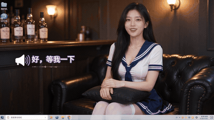
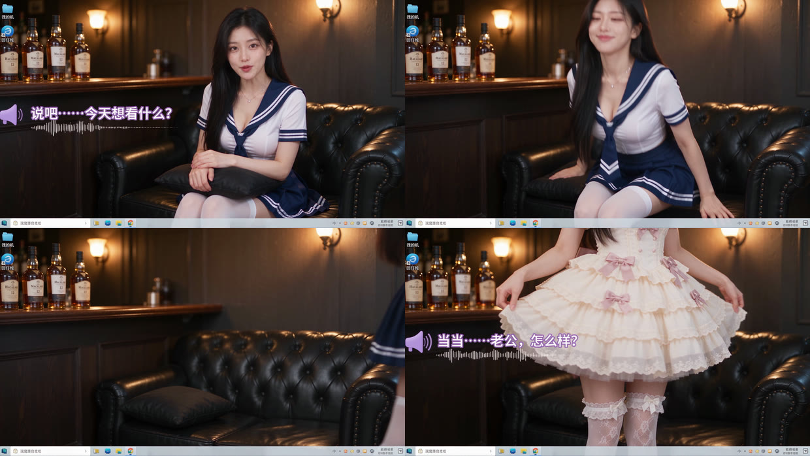

# AI 桌面换装视频

把最近很火的「AI 桌面换装视频」拆成了可复用的提示词模板和一个 Agent Skill。一条提示词直出 30 秒成片，不需要任何后期剪辑。


## 效果

下面这段是模板直出的，没有剪辑、没有叠图层。注意镜头全程一动没动——人站起来的时候镜头不跟，所以只剩腰部以下入画，这正是它看起来像「真的是我电脑壁纸」的原因。



整条 30 秒的节奏：


## 三种用法

### 1. 直接抄提示词

打开 [提示词.md](提示词.md)，里面是三段可以直接复制的提示词，按顺序用：

| 步骤 | 做什么 | 为什么 |
|---|---|---|
| 第 0 步 | 出一张人物参考图 | 可选。挂了参考图，30 秒里漂脸的概率大幅下降 |
| 第 1 步 | 10 秒验桌面壳 | 先确认桌面 UI、固定机位、左侧字幕这三样能不能成 |
| 第 2 步 | 10 秒验换装节拍 | 全片最容易崩的地方，单独验一次 |
| 第 3 步 | 30 秒全片 | 前两步都稳了再上，省积分也省时间 |

别一上来就抽 30 秒。崩了你分不清是桌面壳崩了、人物漂脸了、还是换装节拍没执行。

### 2. 让 AI 采访你，帮你写提示词

如果想换题材（换人物、换场景、换三套造型），不用自己改模板。打开 [元提示词.md](skills/desktop-outfit-video/元提示词.md)，复制整段贴进豆包 / DeepSeek / ChatGPT / Claude 任意一家，它会反过来问你六个问题，然后吐出一条填好的完整提示词。

六个问题分别是：主角、场景、三套造型、对白、尺度、时长。每个都有默认值，全部回车就是原版复刻。

### 3. 装成 Agent Skill

支持 Cursor、Claude Code 等读取 `SKILL.md` 的客户端：

```bash
git clone https://github.com/liyupi/ai-desktop-outfit-video.git
cp -r ai-desktop-outfit-video/skills/desktop-outfit-video ~/.cursor/skills/
```

之后直接说「帮我做一个桌面换装视频」就会触发。Skill 会先问清需求、生成提示词，再问你是自己复制去即梦用，还是直接调 API 出片。

## 核心原理

这类视频看着复杂，真正让它成立的只有四条。改了任何一条，出来就不是这个味道了。



上面四格从左上到右下，是同一条视频里的四个时刻：

1. **镜头绝对不跟人移动。** 她坐着时是正常的半身构图；一站起来，镜头不抬也不跟，脸直接移出画面上沿。所以展示新造型那几段只看得到腰部以下的裙摆和袜子。这是整条片子真实感的全部来源，也是最多人复刻失败的地方——大部分模型的本能是追着人脸走。
2. **每次换装前留一秒空沙发。** 第三格那个空镜不是废镜头。没有它，换装会变成瞬移，或者衣服直接在身上融化变形。
3. **字幕在画面左侧中部，不在底部。** 放底部就成了普通短视频；放左侧中部，配上扬声器/麦克风图标和跟着声音跳的波形，才像一个桌面语音助手的界面。
4. **八个节拍的顺序不能动。** 台词内容随便换，节拍一个都不能删。

还有一条反直觉的：**时间码只写整秒，不要写 0.1 秒精度**。逐帧比对过原版视频，提示词里写「08.80 换装入画」，实际 9.7 秒才入画。模型遵循的是顺序和相对时长，小数点后面的数字不会被兑现，写了只是浪费提示词长度。

## 调 API 出片

除了在即梦网页版手动跑，也可以直接调火山方舟的 Seedance API 批量生成：

```bash
pip install arkruntime requests
export ARK_API_KEY=你的key

python skills/desktop-outfit-video/scripts/seedance.py \
  --model 你的接入点ID \
  --prompt-file prompt.txt \
  --out output.mp4
```

`--model` 是方舟控制台里的接入点 ID，随账号和模型版本不同，去 [火山方舟控制台](https://console.volcengine.com/ark) 复制，别猜。

有四个参数填错了片子直接废，脚本里已经写死：

| 参数 | 值 | 作用 |
|---|---|---|
| `camera_fixed` | `True` | 官方的固定机位开关，比在提示词里写十遍「不要跟人」都硬。**即梦网页版没有这个开关，走 API 才能用上** |
| `generate_audio` | `True` | 不开就是默片，对白和字幕全没了 |
| `optimize_prompt` | `False` | 开了平台会重写提示词，把调好的节拍和机位规则改掉 |
| `watermark` | `False` | |

## 目录结构

```
.
├── 提示词.md                          三步复刻提示词，复制即用
├── skills/
│   └── desktop-outfit-video/          拷进 ~/.cursor/skills/ 即可使用
│       ├── SKILL.md                   工作流：六问 → 填模板 → 问用户怎么用
│       ├── 元提示词.md                 可分发版，任何 AI 都能跑
│       └── scripts/seedance.py        火山方舟 Seedance API 调用脚本
└── assets/                            README 配图
```

## 避坑

- **尺度卡审核。** 提示词里给了软 / 中 / 硬三档措辞，被拒就降一档重试。别在提示词里堆更多形容词，那只会让模型畸变。想要更明确的人物特征，挂参考图比写文字有效得多。
- **即梦里别开运镜预设。** 这条片子全靠镜头一动不动，开了任何运镜都会毁掉。
- **同一级别抽三次不过就改提示词**，别在同一级硬耗。
- **确认对白音频是开的。** 少了这一步出来是默片，字幕也不会有。

## 致谢

玩法原型来自 [@cnyzgkc](https://x.com/cnyzgkc/status/2099029556434985065) 的作品。本仓库是在逐帧拆解之后重新整理的模板，提示词经过精简和重写，不是原文转载。

## 免责声明

- 生成内容请遵守所在平台的社区规范和相关法律法规。
- 不要用他人肖像作为参考图，除非获得本人授权。
- 本仓库只提供提示词模板和调用脚本，不提供任何模型或生成服务。

## License

[MIT](LICENSE)
